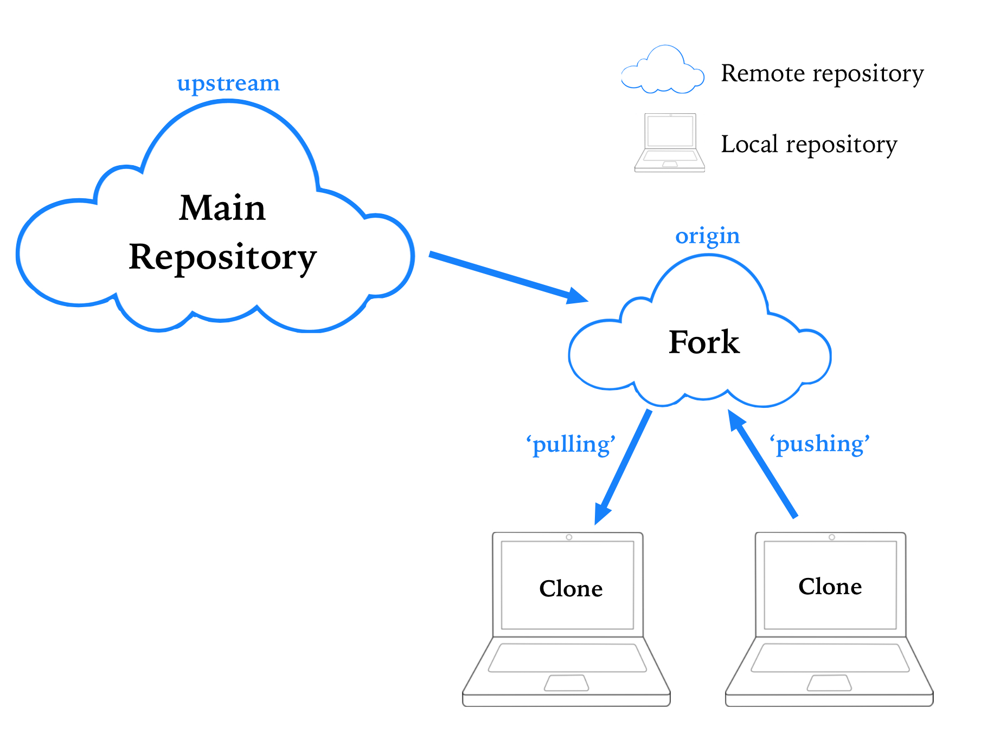

# workflow
This assignment will help in understanding how to use GitHub to collaborate with your team members. 

## Common Git Commands + Using Git

**Git** is the version control software we will be using to keep track of changes made to your web application. There are GUI interfaces available to work with git, but you will benefit greatly as a software developer by learning how to use command line tools to accomplish tasks. These are a few commands that will allow you to effectively use git to version control your project: 

### Making Commits
A "commit" is a record that creates a snapshot of your code, which is added to your repository's history. In order to create this snapshot, you must first *stage* the files you want to include in the snapshot. Once you have staged the files, you must physically create the snapshot within your project's history by making a *commit*.

- To see which files you've modified/added/deleted, and which changes are *staged* to be commited, use `git status`
- To view the changes you've made to each file use `git diff`
- `git add <file_name>` will add the file you specify to *staging*
- To stage all files you've changed, use `git add .`
- To create a new commit with all the files you have staged, type `git commit -m <message>`
- `git hist` will show you a history of all the commits you have added to your project

### Branching 

Branching allows you to experiment with changes to your code base without impacting the working version. 

- `git branch <branch_name>`: Creates a new branch
- `git checkout <branch_name>`: Switch between branches
- `git checkout -b <branch_name>`: A shortcut that creates a new branch, then switches to it

## Forking the repository 

Each team must create changes to their own version of this repository. In order to accomplish this, it is necessary to **fork** the repository. **Forking** creates a copy of the repository that you can then make changes to without changing the original. In order to accomplish this: 

1. Click the 'fork' button

2. Choose the location for your fork (this should be your team's organization)
3. To get a copy of the repository onto your local machine, use `git clone <remote_repository_uri>`

Here is a visual representation of the forking/cloning process

